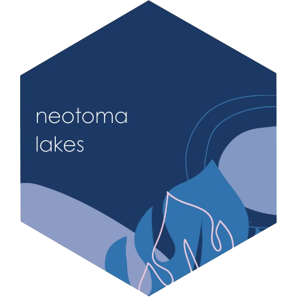
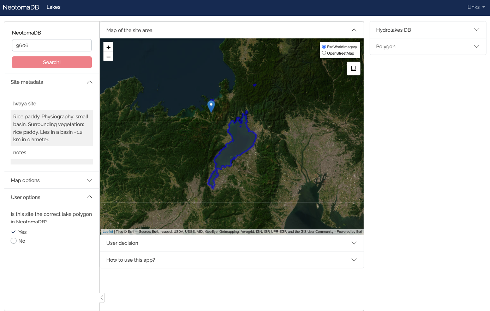
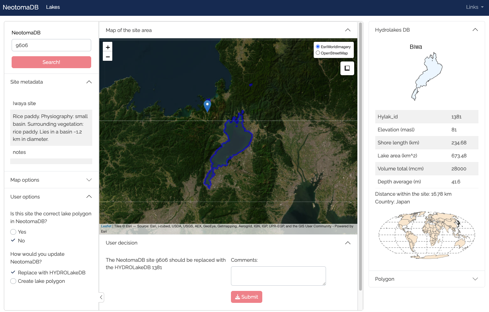
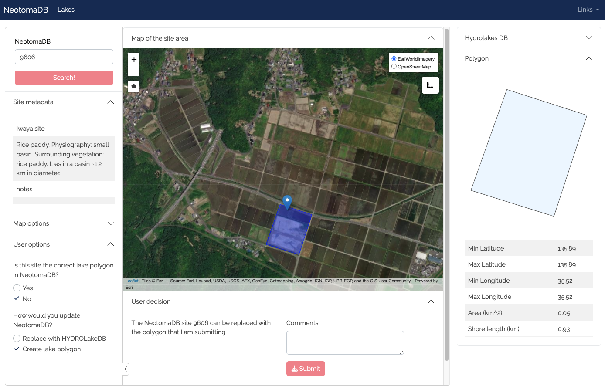

<!-- README.md is generated from README.Rmd. Please edit that file -->

# Neotoma Lakes App 

<!-- badges: start -->

<!-- badges: end -->

The Neotoma Paleoecology Database (“Neotoma”) is more than a database!
Neotoma is a database, a software ecosystem, and a community.

Neotoma provides an underlying cyberinfrastructure that enables the
development of common software tools for data ingest, discovery,
display, analysis, and distribution, while giving domain scientists
control over critical taxonomic and other data quality issues.

## What is Neotoma Lakes app?

The Neotoma Lakes app is an R-Shiny application designed to assist in
improving lake entries within the Neotoma database.

1.  Begin by entering the SiteID: 

2.  2.  Water bodies from the [Hydrolake
        DB](https://wp.geog.mcgill.ca/hydrolab/hydrolakes/) near the
        site will be displayed in blue. Clicking on these water bodies
        allows you to access information within the HYDROLAKE DB
        associated with each lake on the right panel. If one of these
        lakes represents better the Neotoma DB Site, you can submit it
        along with comments. 

3.  If you cannot find a polygon representing your water body in the
    Hydrolakes DB, you have the option to create your own polygon. In
    doing so, you’ll be able to view the information about the polygon
    in the right panel and submitting it to improe the database.
    

## Do you want to contribute?

- Join the [Neotoma
  Community](https://www.neotomadb.org/about/join-the-neotoma-community)
